<div align="center">

# 🏠 SmartDormX
### Smart Hostel Management and Security System
#### AI-Powered Face Recognition · Rule-Based Anomaly Detection · Web-Based Administration

<br/>


<br/>

> **Final Year Project — BS Computer Science**  
> Pak-Austria Fachhochschule: Institute of Applied Sciences & Technology (PAF-IAST)  
> Batch: Fall 2022 – 2026 | Submitted: May 04, 2026

<br/>

🖥️ **Local Deployment** — Production-ready prototype, locally validated  
📄 **Research Paper** — Prepared in IEEE Access format · arXiv submission in progress

</div>

---

## 📌 Table of Contents

- [Overview](#-overview)
- [The Problem](#-the-problem)
- [Our Solution](#-our-solution)
- [System Architecture](#-system-architecture)
- [Key Features](#-key-features)
- [Technology Stack](#-technology-stack)
- [Performance Results](#-performance-results)
- [Screenshots](#-screenshots)
- [Demo Video](#-demo-video)
- [Installation Guide](#-installation-guide)
- [Project Structure](#-project-structure)
- [Database Architecture](#-database-architecture)
- [API Reference](#-api-reference)
- [Challenges and Solutions](#-challenges-and-solutions)
- [Future Enhancements](#-future-enhancements)
- [Team](#-team)
- [Supervisor](#-supervisor)
- [License](#-license)

---

## 🔍 Overview

**SmartDormX** is an integrated smart hostel management and security system that combines
**AI-powered face recognition** with a **comprehensive web-based administration platform**.

The system was designed, developed, and empirically validated as a Final Year Project at
Pak-Austria Fachhochschule (PAF-IAST) to address a genuine institutional challenge —
the absence of an intelligent, automated, and integrated hostel security and management solution.

SmartDormX operates entirely on **standard consumer CPU hardware** with **no GPU requirement**,
using **100% open-source technologies** and **zero-cost infrastructure**,
making it practically deployable in resource-constrained institutional environments.

---

## ❗ The Problem

Hostel management at most institutions — including PAF-IAST — relies on:

- **Manual entry verification** by security guards, prone to fatigue and human error
- **No automated monitoring** of who enters the hostel and when
- **No anomaly detection** for unauthorized access or suspicious entry times
- **Fragmented systems** where security and administration operate independently
- **No digital record** of entry events, making incident investigation impossible
- **Paper-based administration** for room allocation, fee tracking, and mess management

These gaps create real security risks and significant administrative inefficiency
that affect hostel wardens, security personnel, and residents alike.

---

## ✅ Our Solution

SmartDormX delivers an end-to-end integrated platform with two core subsystems:

### Subsystem 1 — AI Face Recognition and Anomaly Detection Engine
- Real-time face recognition using a live camera feed
- dlib ResNet 128-dimensional facial encoding with HOG detection
- Euclidean distance matching against enrolled student database
- Three-rule anomaly detection engine (no ML training required)
- Automatic event logging with 5-second duplicate suppression
- Live MJPEG video stream accessible from any browser

### Subsystem 2 — Web-Based Hostel Management Platform
- Full administrator portal with 10 management modules
- Student-facing portal with 7 self-service modules
- Cloud-backed Supabase PostgreSQL database
- Secure authentication via Supabase Auth
- Accessible from any modern browser on the local network

---

## 🏗️ System Architecture
```
┌─────────────────────────────────────────────────────────────┐
│ PRESENTATION LAYER │
│ Admin Portal (HTML/CSS/JS) + Student Portal │
└────────────────────┬────────────────────────────────────────┘
│ REST API + Supabase JS Client
┌────────────────────▼────────────────────────────────────────┐
│ APPLICATION LAYER │
│ Flask Backend (app.py) + REST API │
│ Camera Recognition Thread │
└──────────┬─────────────────────────┬───────────────────────┘
│ │
┌──────────▼──────────┐ ┌──────────▼──────────────────────┐
│ AI PROCESSING │ │ DATA LAYER │
│ LAYER │ │ │
│ - HOG Detector │ │ SQLite (local recognition log) │
│ - dlib ResNet │ │ Supabase PostgreSQL (cloud) │
│ - AnomalyDetector │ │ Local image storage (/images) │
└─────────────────────┘ └──────────────────────────────────┘
```

### End-to-End Recognition Flow
```
Camera Frame
│
▼
HOG Face Detection
│
▼
dlib ResNet 128-d Encoding
│
▼
Euclidean Distance Matching (threshold: 0.60)
│
├── Match Found (confidence ≥ 45%) → AUTHORIZED
│
└── No Match → UNKNOWN → UNAUTHORIZED
│
▼
AnomalyDetector.detect(name, confidence)
│
├── Rule 1: Unknown Person → HIGH severity
├── Rule 2: Near-miss low confidence → MEDIUM severity
└── Rule 3: Hour 00:00–05:00 → MEDIUM severity
│
▼
SQLite Log Entry (5-second cooldown)
│
▼
MJPEG Stream → Admin Browser (3-second auto-refresh)
```
---

## ✨ Key Features

### 🔐 Face Recognition and Security

| Feature | Detail |
|---------|--------|
| Real-Time Face Recognition | HOG detection + dlib ResNet encoding |
| Multi-Image Enrollment | 12 images per student for robust coverage |
| Bulk CSV Import | Register multiple students simultaneously |
| Three-Rule Anomaly Detection | Unknown person, low confidence, late-night entry |
| Automatic Event Logging | SQLite with 5-second duplicate suppression |
| Live Camera Stream | MJPEG served via Flask, browser-compatible |
| Automatic Stream Recovery | Frontend retry logic with cache-busting |

### 🖥️ Administrator Portal (10 Modules)

| Module | Capability |
|--------|-----------|
| Dashboard | Live statistics, Chart.js doughnut chart, real-time counters |
| Student Directory | Full CRUD, search, Excel export |
| Room Management | 5 hostel blocks, occupancy tracking |
| Hostel Fee Tracking | Semester-wise, status management, CSV export |
| Mess Fee Tracking | Monthly records, payment status |
| Mess Management | Weekly menu, meal attendance, feedback |
| Announcements | Target by gender/audience, priority levels |
| Request Handling | Pending queue, resolve/reject with notes |
| Recognition Logs | Filterable log viewer, anomaly highlighting |
| Admin Profile | Profile management |

### 🎓 Student Portal (7 Modules)

| Module | Capability |
|--------|-----------|
| Dashboard | Personalized metrics, meal toggle, trend chart |
| Profile | Personal information management |
| My Room | Room details, occupancy, roommate info |
| My Fee | Hostel and mess fee records, payment upload |
| Mess and Dining | Menu viewing, meal attendance marking |
| Notifications | Announcements with priority filtering |
| Requests | Submit and track maintenance requests and complaints |

---

## 🛠️ Technology Stack

| Layer | Technology | Purpose |
|-------|-----------|---------|
| Backend Language | Python 3.10 | Core application and AI pipeline |
| Web Framework | Flask 3.0.0 | REST API and MJPEG streaming |
| Face Detection | HOG (face_recognition) | CPU-efficient face localization |
| Face Encoding | dlib ResNet 128-d | 99.38% LFW benchmark accuracy |
| Computer Vision | OpenCV 4.8.1 | Frame processing and video streaming |
| Anomaly Detection | Rule-based engine (custom) | Zero training data required |
| Local Database | SQLite3 | Offline recognition event logging |
| Cloud Database | Supabase (PostgreSQL) | Managed cloud hostel management data |
| Authentication | Supabase Auth | Secure admin and student login |
| Frontend | HTML5, CSS3, JavaScript ES6 | No framework overhead |
| Data Visualization | Chart.js | Dashboard charts |
| Numerical Computing | NumPy 1.24.3 | Distance calculations |
| Video Streaming | MJPEG via Flask | Browser-compatible live feed |
| Version Control | Git and GitHub | Collaboration and versioning |
| Camera Hardware | iPhone via USB | High-resolution input source |

---

## 📊 Performance Results

### Recognition Accuracy by Development Phase

| Phase | Camera | Images/Student | Lighting | Accuracy |
|-------|--------|----------------|----------|----------|
| Phase 1 | Laptop webcam | 2–3 | Standard | < 50% |
| Phase 2 | iPhone (USB) | 2–3 | Standard | 50–55% |
| Phase 3 | iPhone (USB) | 12 | Standard | 65–75% |
| Phase 3 Optimized | iPhone (USB) | 12 | Good | **79.3%–81.9% (mean: 81.0%)** |

### Confusion Matrix — Controlled Evaluation

| | Predicted: Known | Predicted: Unknown |
|--|--|--|
| **Actual: Known** | TP = 31 | FN = 7 |
| **Actual: Unknown** | FP = 0 | TN = 180 |

### Recognition Performance Metrics

| Metric | Value | Notes |
|--------|-------|-------|
| Precision | **100%** | TP / (TP + FP) |
| Recall | **81.6%** | TP / (TP + FN) |
| F1-Score | **89.8%** | 2 × (P × R) / (P + R) |
| Overall Accuracy | **96.8%** | (TP + TN) / Total |
| Mean Recognition Accuracy | **81.0%** | Operational conditions |
| True Negative Rate | **100%** | 180/180 unknown subjects rejected |

### Anomaly Detection Performance

| Rule | Test Sample | Detection Rate | False Flag Rate |
|------|------------|---------------|-----------------|
| Unknown Person Detection | 180 subjects | **100%** | 0% |
| Late-Night Entry Detection | 50 events | **100%** | 0% |
| Low-Confidence Detection | 10 events | **90%** | 10% |

### System Statistics — Live Deployment

| Metric | Result |
|--------|--------|
| Enrolled Individuals | 31 students |
| Total Enrolled Images | 372 images |
| Images per Student | 12 |
| Total Recognition Events | 1,700+ |
| Authorized Events | 769 |
| Unauthorized Events | 931 |
| Low Confidence Events | 230 |
| Late Night Events (simulated) | 50 |
| Total Anomalous Events | 1,211 |
| Overall Anomaly Rate | ~71% |
| Recognition Speed | 1–2 seconds per face (CPU-only) |
| Operating Range | Up to 5 metres |
| Video Stream | ~25 FPS MJPEG |

### Performance vs Literature Benchmark

| Metric | SmartDormX (CPU) | Literature (GPU) |
|--------|-----------------|-----------------|
| Recognition Accuracy | 79.3%–81.9% (mean: 81.0%) | 95%+ |
| False Positive Rate | **0%** | < 5% |
| Speed | 1–2 sec/face | < 200ms |
| Hardware | Consumer CPU | NVIDIA GPU |
| Cost | **Zero** | High |

> **Key Finding 1:** Increasing enrollment images from 2–3 to 12 per student
> produced a 15–20% accuracy improvement — greater than any hardware upgrade.
>
> **Key Finding 2:** Zero false positives across 180 unknown test subjects
> confirms the system's reliability as a security tool.

---

## 📸 Screenshots

### Admin Portal

| Dashboard | Face Recognition Live Feed |
|-----------|---------------------------|
| 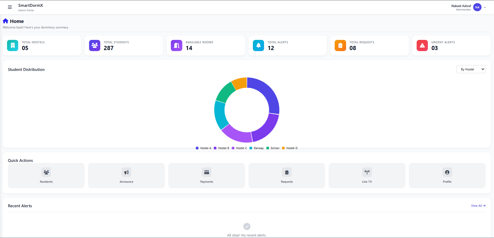 | 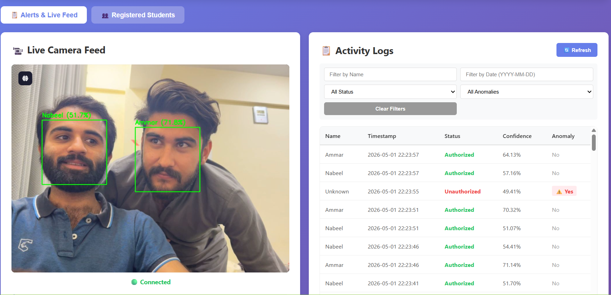 |

| Residents Management | Fee Management |
|---------------------|----------------|
| 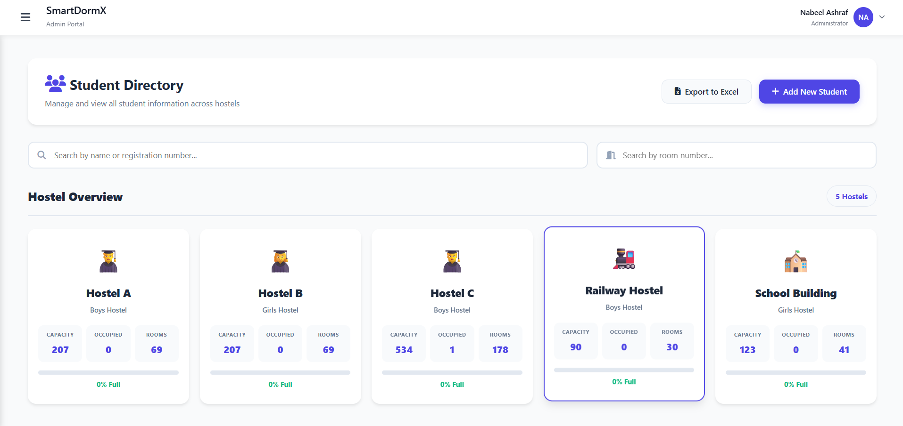 | 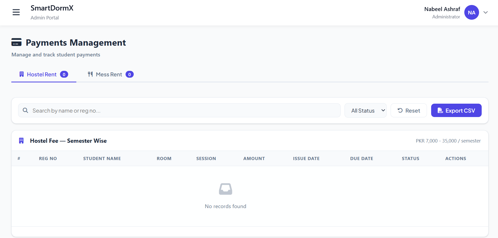 |

| Mess Management | Requests |
|----------------|----------|
| 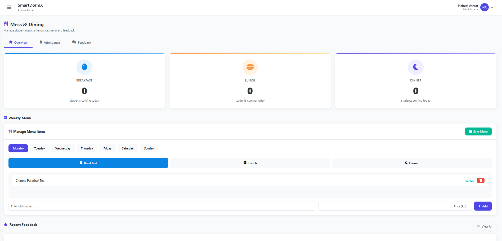 | 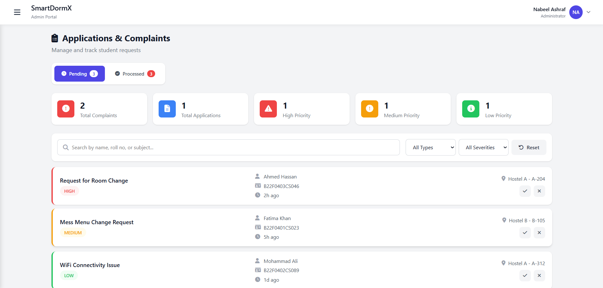 |

| Announcements |
|---------------|
| 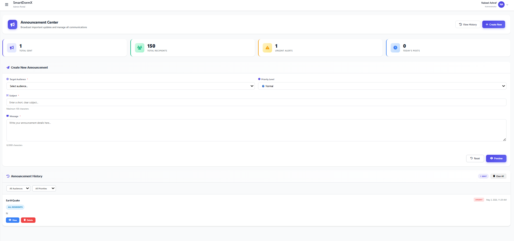 |

### Student Portal

| Student Dashboard | My Profile |
|------------------|------------|
| 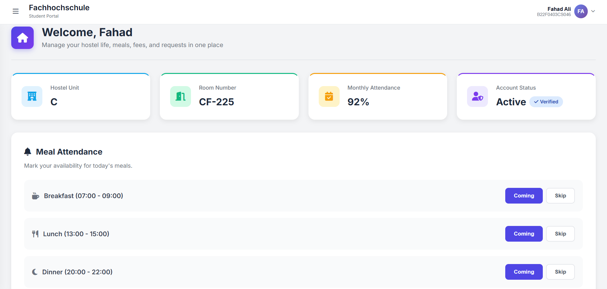 | 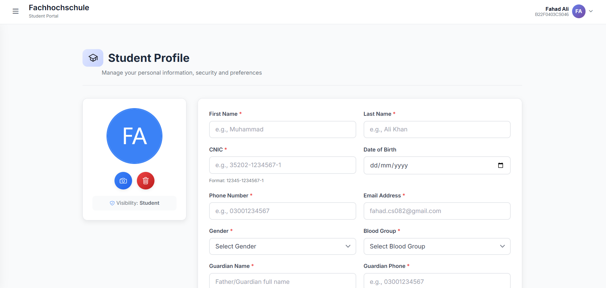 |

| My Room | My Fee |
|---------|--------|
| 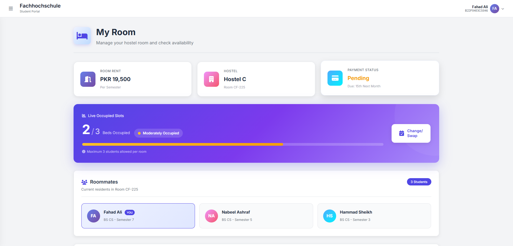 | 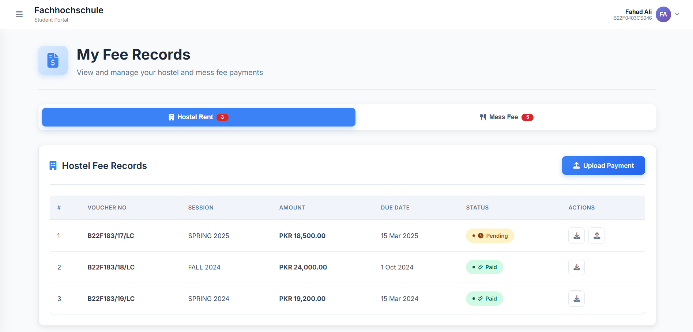 |

| Mess and Dining | Notifications |
|----------------|---------------|
| 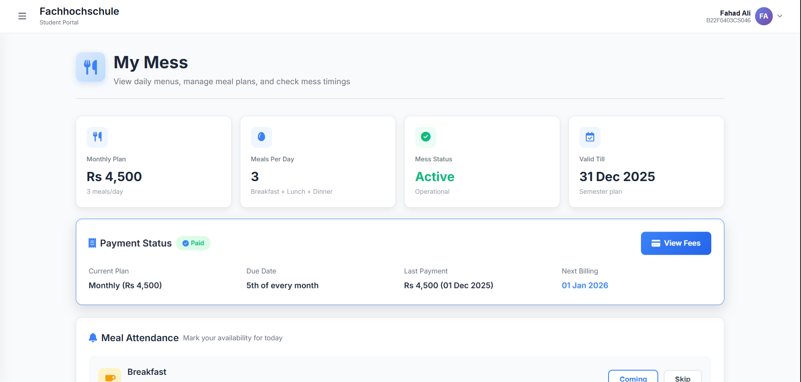 | 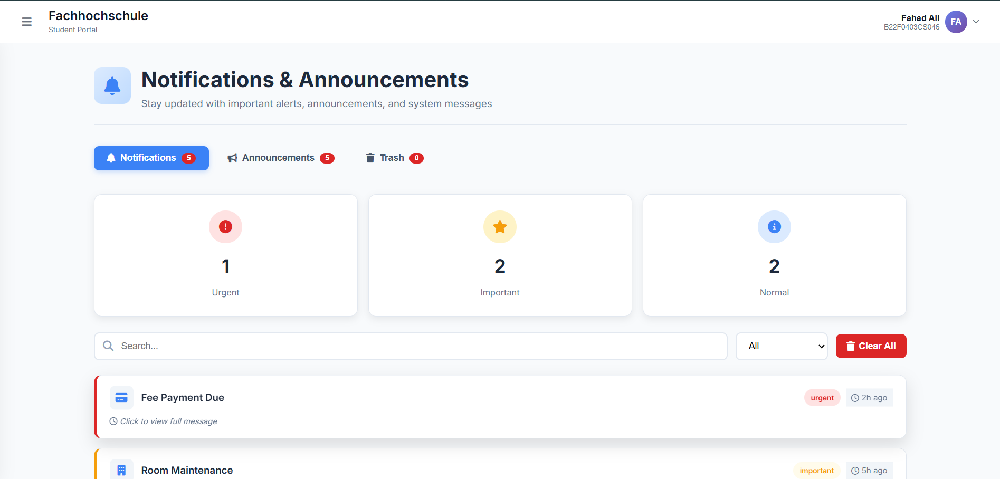 |

---

## 🎬 Demo Video

> 🔄 **Full system demo video coming soon.**
> The complete walkthrough video covering face recognition,
> admin portal, and student portal is currently being recorded.

---

## ⚙️ Installation Guide

### Prerequisites

| Requirement | Version |
|------------|---------|
| Python | 3.10 |
| Git | Latest |
| VS Code | Latest (recommended) |
| iPhone or Webcam | For camera input |

> ⚠️ **Windows Users:** dlib does not have a standard pip wheel for
> Python 3.10 on Windows. Follow Step 3 carefully.

---

### Step 1 — Clone the Repository
```bash
git clone https://github.com/mnabeelashraf/SmartDormX.git
cd SmartDormX
```
### Step 2 — Create Virtual Environment
```bash

python -m venv fr_env_new
fr_env_new\Scripts\activate
```
### Step 3 — Install dlib (Windows Critical Step)
dlib must be installed from a pre-compiled wheel on Windows with Python 3.10.

Download the wheel file:
dlib-19.22.99-cp310-cp310-win_amd64.whl

Then install:

```bash
pip install path\to\dlib-19.22.99-cp310-cp310-win_amd64.whl
```
### Step 4 — Install All Dependencies
```
pip install -r requirements.txt
```
### Step 5 — Configure Supabase
Open frontend/supabase-config.js and replace with your credentials:

```
const SUPABASE_URL = 'your-supabase-project-url';
const SUPABASE_ANON_KEY = 'your-supabase-anon-key';
Open student-portal/student-supabase-config.js and do the same.
```
### Step 6 — Start the Backend
```
cd backend
python app.py
```
Expected output:

```
[INFO] Starting Smart Hostel Management System - Version 6
[INFO] Access frontend at http://localhost:5000
[INFO] Upload folder: .../backend/images
[INFO] Bulk upload folder: .../backend/bulk_upload
```
### Step 7 — Open the Frontend
Use VS Code Live Server to serve the frontend.

| Portal	| URL |
|--------|-----|
| Admin Portal	| http://127.0.0.1:5500/frontend/sign-in.html |
| Student Portal	| http://127.0.0.1:5500/student-portal/sign-in.html |
| Flask API	| http://localhost:5000 |

---
### 📁 Project Structure
```
SmartDormX/
│
├── backend/                        # Flask backend
│   ├── app.py                      # Main Flask app + CameraRecognizer
│   ├── database.py                 # SQLite database management
│   ├── anomaly_detector.py         # Rule-based anomaly detection engine
│   ├── database.db                 # SQLite database (auto-created)
│   ├── images/                     # Stored student facial images
│   └── bulk_upload/                # Temporary folder for CSV import images
│
├── frontend/                       # Administrator portal
│   ├── alerts.html                 # Face recognition monitoring
│   ├── dashboard.html              # Admin dashboard with stats
│   ├── residents.html              # Student directory management
│   ├── payments.html               # Fee management
│   ├── mess.html                   # Mess and dining management
│   ├── requests.html               # Request and complaint processing
│   ├── announcements.html          # Announcement publishing
│   ├── profile.html                # Admin profile management
│   ├── sign-in.html                # Admin authentication
│   ├── supabase-config.js          # Supabase client initialization
│   ├── supabase-helpers.js         # Shared CRUD helper functions
│   └── migration-tool.js           # Data migration utility
│
├── student-portal/                 # Student portal
│   ├── std-dashboard.html          # Student home dashboard
│   ├── std-profile.html            # Student profile management
│   ├── std-fee.html                # Fee viewing and payment upload
│   ├── std-mess.html               # Mess information and attendance
│   ├── std-room.html               # Room details and search
│   ├── std-notifications.html      # Notifications and announcements
│   ├── std-requests.html           # Request submission and tracking
│   └── student-supabase-config.js  # Student Supabase client config
│
├── assets/                         # Screenshots for README
├── requirements.txt                # Python dependencies
├── LICENSE                         # MIT License
└── README.md                       # This file
```

---
### 🗄️ Database Architecture
SmartDormX uses a Hybrid Dual-Database Architecture:
```
┌─────────────────────────────┐    ┌──────────────────────────────────┐
│     SQLite (Local)          │    │    Supabase PostgreSQL (Cloud)    │
│                             │    │                                   │
│  Works OFFLINE              │    │  Accessible from any browser      │
│                             │    │                                   │
│  Tables:                    │    │  Tables:                          │
│  • users                    │    │  • students                       │
│  • user_images              │    │  • payments_hostel                │
│  • logs                     │    │  • payments_mess                  │
│                             │    │  • mess_attendance                │
│  Purpose:                   │    │  • mess_menu                      │
│  Face recognition           │    │  • announcements                  │
│  event logging              │    │  • requests                       │
│                             │    │  • dashboard_alerts               │
└─────────────────────────────┘    └──────────────────────────────────┘
```
---
### 📡 API Reference

|Endpoint |	Method |	Description |
|---------|--------|-------------|
| /video_feed |	GET	| Live MJPEG camera stream |
| /logs |	GET	| Recognition logs with filters |
| /users |	GET | All enrolled students |
| /add_user |	POST	| Register student with images |
| /delete_user/<id> | DELETE |	Remove student from system |
| /import_csv |	POST |	Bulk import students via CSV |
| /stats |	GET |	System statistics summary |
| /user_image/<id> |	GET |	Retrieve student primary image |
| /refresh_logs |	POST |	Force log refresh |
---
### ⚡ Challenges and Solutions
|Challenge |	Impact |	Solution Applied |
|---|---|---| 
|No GPU hardware available|	Recognition speed 1–2 sec/face|	Reduced resolution to 640×480, capped FPS|
|Laptop webcam gave < 50% accuracy|	System unusable for security|	Switched to iPhone via USB → 81.0% accuracy|
|dlib has no pip wheel for Windows + Python 3.10|	Installation failure|	Used pre-compiled .whl file|
|Lighting sensitivity|	Accuracy drops below 50% in dim light|	Documented requirement for dedicated entry lighting|
|Continuous logging of same person|	Database flooding|	Implemented 5-second per-identity cooldown|
|Student and admin portal DB integration|	Data not fully synchronized|	Identified for Version 2.0 development|
|No liveness detection|	Spoofing vulnerability|	Documented for future implementation|
---
### 🚀 Future Enhancements

#### High Priority

 * Liveness detection and anti-spoofing (Silent-Face-Anti-Spoofing CNN)
 * GPU-accelerated recognition (CUDA dlib or InsightFace ArcFace)
 * Full student-administrator portal database integration
 * Real-time SMS and email alerts (Twilio + SendGrid)

#### Medium Priority

* Visitor management module
* Multi-camera and IP/CCTV camera support (RTSP)
* Automated attendance via face recognition at mess entry
* Mobile application (React Native or Flutter)

#### Low Priority

* Automated PDF report generation
* Machine learning anomaly detection (Isolation Forest)
* Docker containerization for simplified deployment
* Biometric data encryption (AES-256)
* Web-based system configuration panel

---
### 👥 Team

| Name	| Roll Number	| Responsibility |
|---|---|---|
| Muhammad Nabeel Ashraf	| B22F1154CS030	| Face Recognition Module · Camera Integration · Anomaly Detection Engine |
| Fahad Ali	| B22F0403CS046	| Hostel Management Dashboard · Database Design · Supabase Integration |
| Muhammad Uzair Khan |	B22F0076CS092	| Student Portal Development · System Integration · Testing and Documentation |

---
### 👨‍🏫 Supervisor
Dr. Muhammad Shoaib Qureshi
Assistant Professor
School of Computing Sciences
Pak-Austria Fachhochschule: Institute of Applied Sciences and Technology (PAF-IAST)

---
### 🏛️ Institution
Pak-Austria Fachhochschule: Institute of Applied Sciences and Technology
Mang, Haripur, Khyber Pakhtunkhwa, Pakistan
www.paf-iast.edu.pk

---
### 📄 License
This project is licensed under the MIT License.
See the LICENSE file for full details.

---
### 📚 Key References
* Kortli et al. (2020) — HOG + deep learning encoder for CPU-efficient face recognition
* Adjabi et al. (2020) — ResNet encoders outperform classical methods on LFW benchmark
* Chandola et al. (2009) — Rule-based anomaly detection for interpretability
* King, D.E. (2009) — dlib machine learning toolkit
* Guo and Zhang (2019) — Survey on deep learning based face recognition

---
<div align="center">
 
> SmartDormX — Built with dedication at PAF-IAST 
> Integrating Artificial Intelligence with Institutional Management
> 
> ⭐ If this project helped you — please give it a star

</div> 
